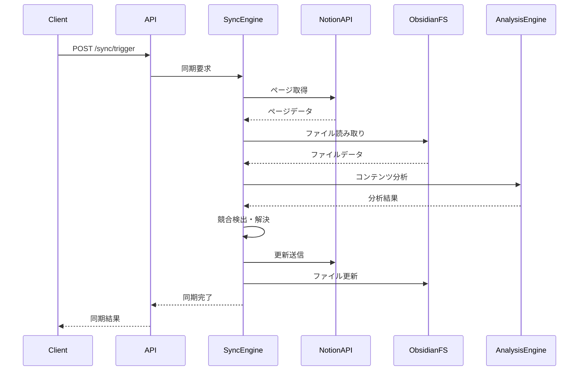
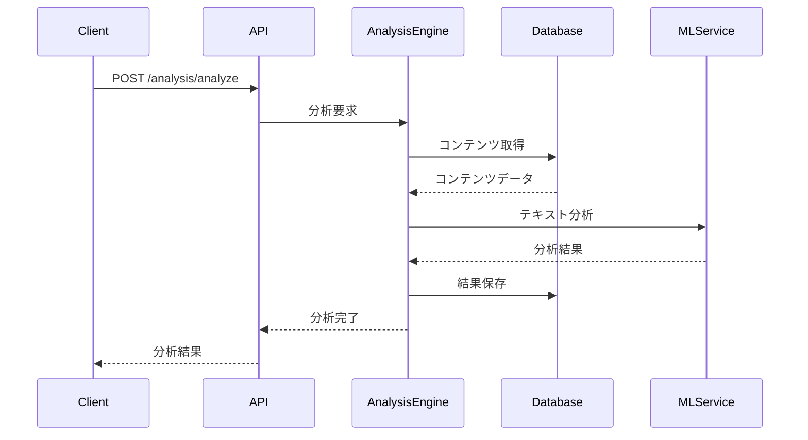

# API設計

## 概要

Notion ↔ Obsidian Sync SystemのAPI設計を定義します。RESTful API、WebSocket、データフロー、認証・認可、エラーハンドリングを説明します。

## API アーキテクチャ

```
┌─────────────────────────────────────────────────────────────┐
│                    Client Applications                       │
│  Web UI │ Mobile App │ CLI Tool │ Browser Extension         │
└─────────────────────────────────────────────────────────────┘
                              │
                              ▼
┌─────────────────────────────────────────────────────────────┐
│                    API Gateway                               │
│  Rate Limiting │ Authentication │ Request Routing          │
└─────────────────────────────────────────────────────────────┘
                              │
                              ▼
┌─────────────────────────────────────────────────────────────┐
│                    Core Services                             │
│  Sync Service │ Analysis Service │ Notification Service     │
└─────────────────────────────────────────────────────────────┘
                              │
                              ▼
┌─────────────────────────────────────────────────────────────┐
│                    External APIs                             │
│  Notion API │ Obsidian FS │ AI Services │ Storage          │
└─────────────────────────────────────────────────────────────┘
```

## RESTful API エンドポイント

### 認証・認可

```http
# ユーザー認証
POST /api/v1/auth/login
Content-Type: application/json

{
  "email": "user@example.com",
  "password": "password123"
}

Response:
{
  "access_token": "eyJ0eXAiOiJKV1QiLCJhbGciOiJIUzI1NiJ9...",
  "refresh_token": "eyJ0eXAiOiJKV1QiLCJhbGciOiJIUzI1NiJ9...",
  "token_type": "bearer",
  "expires_in": 3600
}

# トークン更新
POST /api/v1/auth/refresh
Content-Type: application/json

{
  "refresh_token": "eyJ0eXAiOiJKV1QiLCJhbGciOiJIUzI1NiJ9..."
}

# ログアウト
POST /api/v1/auth/logout
Authorization: Bearer <access_token>
```

### コンテンツ管理

```http
# コンテンツアイテム一覧取得
GET /api/v1/content-items
Authorization: Bearer <access_token>
Query Parameters:
  - page: ページ番号 (default: 1)
  - limit: 取得件数 (default: 20)
  - source: ソースプラットフォーム (notion|obsidian)
  - tags: タグフィルター (カンマ区切り)
  - search: 検索クエリ
  - sort: ソート順 (created_at|updated_at|title)

Response:
{
  "data": [
    {
      "id": "uuid",
      "title": "ページタイトル",
      "content": "コンテンツの一部...",
      "content_type": "page",
      "source": "notion",
      "source_id": "notion-page-id",
      "created_at": "2024-01-01T00:00:00Z",
      "updated_at": "2024-01-01T00:00:00Z",
      "tags": ["tag1", "tag2"],
      "sync_status": "synced"
    }
  ],
  "pagination": {
    "page": 1,
    "limit": 20,
    "total": 100,
    "pages": 5
  }
}

# 特定のコンテンツアイテム取得
GET /api/v1/content-items/{id}
Authorization: Bearer <access_token>

Response:
{
  "id": "uuid",
  "title": "ページタイトル",
  "content": "完全なコンテンツ...",
  "content_type": "page",
  "source": "notion",
  "source_id": "notion-page-id",
  "parent_id": "parent-uuid",
  "metadata": {
    "notion_properties": {...},
    "obsidian_frontmatter": {...}
  },
  "tags": ["tag1", "tag2"],
  "links": [
    {
      "target_id": "target-uuid",
      "link_type": "reference",
      "created_at": "2024-01-01T00:00:00Z"
    }
  ],
  "attachments": [
    {
      "id": "attachment-uuid",
      "filename": "image.jpg",
      "file_size": 1024000,
      "mime_type": "image/jpeg"
    }
  ],
  "sync_status": "synced",
  "created_at": "2024-01-01T00:00:00Z",
  "updated_at": "2024-01-01T00:00:00Z"
}

# コンテンツアイテム作成
POST /api/v1/content-items
Authorization: Bearer <access_token>
Content-Type: application/json

{
  "title": "新しいページ",
  "content": "ページの内容...",
  "content_type": "page",
  "source": "notion",
  "parent_id": "parent-uuid",
  "tags": ["tag1", "tag2"]
}

# コンテンツアイテム更新
PUT /api/v1/content-items/{id}
Authorization: Bearer <access_token>
Content-Type: application/json

{
  "title": "更新されたタイトル",
  "content": "更新された内容...",
  "tags": ["tag1", "tag3"]
}

# コンテンツアイテム削除
DELETE /api/v1/content-items/{id}
Authorization: Bearer <access_token>
```

### 同期管理

```http
# 同期状態取得
GET /api/v1/sync/status
Authorization: Bearer <access_token>

Response:
{
  "sync_status": "active",
  "last_sync": "2024-01-01T00:00:00Z",
  "pending_items": 5,
  "conflict_items": 2,
  "error_items": 0
}

# 手動同期実行
POST /api/v1/sync/trigger
Authorization: Bearer <access_token>
Content-Type: application/json

{
  "sync_type": "bidirectional", // "notion_to_obsidian", "obsidian_to_notion", "bidirectional"
  "force": false
}

Response:
{
  "sync_id": "sync-uuid",
  "status": "started",
  "estimated_duration": 300
}

# 同期進捗取得
GET /api/v1/sync/{sync_id}/progress
Authorization: Bearer <access_token>

Response:
{
  "sync_id": "sync-uuid",
  "status": "running",
  "progress": {
    "total_items": 100,
    "processed_items": 45,
    "percentage": 45
  },
  "current_operation": "syncing_notion_pages"
}

# 同期競合一覧
GET /api/v1/sync/conflicts
Authorization: Bearer <access_token>

Response:
{
  "data": [
    {
      "id": "conflict-uuid",
      "content_item_id": "content-uuid",
      "conflict_type": "content",
      "conflict_data": {
        "notion_version": {...},
        "obsidian_version": {...}
      },
      "resolution_status": "pending",
      "created_at": "2024-01-01T00:00:00Z"
    }
  ]
}

# 同期競合解決
POST /api/v1/sync/conflicts/{conflict_id}/resolve
Authorization: Bearer <access_token>
Content-Type: application/json

{
  "resolution": "notion", // "notion", "obsidian", "merge", "custom"
  "custom_content": "カスタム解決内容..." // resolutionが"custom"の場合
}
```

### 分析・推奨

```http
# コンテンツ分析実行
POST /api/v1/analysis/analyze
Authorization: Bearer <access_token>
Content-Type: application/json

{
  "content_item_ids": ["uuid1", "uuid2"],
  "analysis_types": ["similarity", "topic", "sentiment"]
}

Response:
{
  "analysis_id": "analysis-uuid",
  "status": "completed",
  "results": {
    "similarity": [
      {
        "source_id": "uuid1",
        "target_id": "uuid2",
        "similarity_score": 0.85
      }
    ],
    "topics": [
      {
        "content_item_id": "uuid1",
        "topics": ["AI", "Machine Learning"],
        "confidence_scores": [0.9, 0.8]
      }
    ]
  }
}

# 類似コンテンツ検索
GET /api/v1/analysis/similar/{content_item_id}
Authorization: Bearer <access_token>
Query Parameters:
  - limit: 取得件数 (default: 10)
  - threshold: 類似度閾値 (default: 0.7)

Response:
{
  "data": [
    {
      "content_item_id": "similar-uuid",
      "title": "類似ページ",
      "similarity_score": 0.85,
      "common_tags": ["tag1", "tag2"],
      "common_links": 3
    }
  ]
}

# 推奨コンテンツ取得
GET /api/v1/recommendations
Authorization: Bearer <access_token>
Query Parameters:
  - type: 推奨タイプ (related|trending|recent)
  - limit: 取得件数 (default: 10)

Response:
{
  "data": [
    {
      "content_item_id": "recommended-uuid",
      "title": "推奨ページ",
      "recommendation_type": "related",
      "confidence_score": 0.9,
      "reason": "類似タグと高い関連性"
    }
  ]
}

# 重複コンテンツ検出
GET /api/v1/analysis/duplicates
Authorization: Bearer <access_token>
Query Parameters:
  - threshold: 重複閾値 (default: 0.9)
  - auto_merge: 自動統合フラグ (default: false)

Response:
{
  "data": [
    {
      "group_id": "duplicate-group-uuid",
      "items": [
        {
          "content_item_id": "uuid1",
          "title": "ページ1",
          "similarity_score": 0.95
        },
        {
          "content_item_id": "uuid2",
          "title": "ページ2",
          "similarity_score": 0.95
        }
      ],
      "suggested_action": "merge"
    }
  ]
}
```

### タグ管理

```http
# タグ一覧取得
GET /api/v1/tags
Authorization: Bearer <access_token>

Response:
{
  "data": [
    {
      "id": "tag-uuid",
      "name": "AI",
      "color": "#FF5733",
      "description": "人工知能関連",
      "usage_count": 25,
      "created_at": "2024-01-01T00:00:00Z"
    }
  ]
}

# タグ作成
POST /api/v1/tags
Authorization: Bearer <access_token>
Content-Type: application/json

{
  "name": "新しいタグ",
  "color": "#FF5733",
  "description": "タグの説明"
}

# タグ更新
PUT /api/v1/tags/{tag_id}
Authorization: Bearer <access_token>
Content-Type: application/json

{
  "name": "更新されたタグ",
  "color": "#33FF57",
  "description": "更新された説明"
}

# タグ削除
DELETE /api/v1/tags/{tag_id}
Authorization: Bearer <access_token>
```

## WebSocket API

### リアルタイム同期

```javascript
// WebSocket接続
const ws = new WebSocket('wss://api.notionxobsidian.com/ws/sync');

// 接続確立
ws.onopen = function() {
  console.log('WebSocket接続確立');
  
  // 認証
  ws.send(JSON.stringify({
    type: 'auth',
    token: 'access_token_here'
  }));
};

// メッセージ受信
ws.onmessage = function(event) {
  const message = JSON.parse(event.data);
  
  switch(message.type) {
    case 'sync_progress':
      console.log('同期進捗:', message.data);
      break;
    case 'sync_complete':
      console.log('同期完了:', message.data);
      break;
    case 'sync_conflict':
      console.log('同期競合:', message.data);
      break;
    case 'content_updated':
      console.log('コンテンツ更新:', message.data);
      break;
  }
};

// 手動同期要求
ws.send(JSON.stringify({
  type: 'trigger_sync',
  data: {
    sync_type: 'bidirectional'
  }
}));
```

### リアルタイム通知

```javascript
// 通知購読
ws.send(JSON.stringify({
  type: 'subscribe',
  channel: 'notifications'
}));

// 通知メッセージ
{
  "type": "notification",
  "data": {
    "id": "notification-uuid",
    "title": "同期完了",
    "message": "5件のアイテムが同期されました",
    "level": "info", // "info", "warning", "error"
    "timestamp": "2024-01-01T00:00:00Z",
    "actions": [
      {
        "label": "詳細を見る",
        "action": "view_details",
        "url": "/sync/logs/123"
      }
    ]
  }
}
```

## データフロー設計

### 同期フロー



### 分析フロー



## エラーハンドリング

### HTTPステータスコード

```http
# 成功レスポンス
200 OK - リクエスト成功
201 Created - リソース作成成功
204 No Content - リクエスト成功（コンテンツなし）

# クライアントエラー
400 Bad Request - リクエストが無効
401 Unauthorized - 認証が必要
403 Forbidden - アクセス権限なし
404 Not Found - リソースが見つからない
409 Conflict - リソース競合
422 Unprocessable Entity - バリデーションエラー
429 Too Many Requests - レート制限超過

# サーバーエラー
500 Internal Server Error - サーバー内部エラー
502 Bad Gateway - ゲートウェイエラー
503 Service Unavailable - サービス利用不可
504 Gateway Timeout - ゲートウェイタイムアウト
```

### エラーレスポンス形式

```json
{
  "error": {
    "code": "VALIDATION_ERROR",
    "message": "リクエストの検証に失敗しました",
    "details": [
      {
        "field": "title",
        "message": "タイトルは必須です"
      },
      {
        "field": "content",
        "message": "コンテンツは1000文字以内で入力してください"
      }
    ],
    "timestamp": "2024-01-01T00:00:00Z",
    "request_id": "req-uuid"
  }
}
```

### エラーコード一覧

```python
# エラーコード定義
class ErrorCodes:
    # 認証・認可
    INVALID_CREDENTIALS = "INVALID_CREDENTIALS"
    TOKEN_EXPIRED = "TOKEN_EXPIRED"
    INSUFFICIENT_PERMISSIONS = "INSUFFICIENT_PERMISSIONS"
    
    # バリデーション
    VALIDATION_ERROR = "VALIDATION_ERROR"
    REQUIRED_FIELD_MISSING = "REQUIRED_FIELD_MISSING"
    INVALID_FORMAT = "INVALID_FORMAT"
    
    # リソース
    RESOURCE_NOT_FOUND = "RESOURCE_NOT_FOUND"
    RESOURCE_CONFLICT = "RESOURCE_CONFLICT"
    RESOURCE_LOCKED = "RESOURCE_LOCKED"
    
    # 同期
    SYNC_IN_PROGRESS = "SYNC_IN_PROGRESS"
    SYNC_CONFLICT = "SYNC_CONFLICT"
    SYNC_FAILED = "SYNC_FAILED"
    
    # 外部API
    NOTION_API_ERROR = "NOTION_API_ERROR"
    OBSIDIAN_ACCESS_ERROR = "OBSIDIAN_ACCESS_ERROR"
    
    # システム
    INTERNAL_ERROR = "INTERNAL_ERROR"
    SERVICE_UNAVAILABLE = "SERVICE_UNAVAILABLE"
    RATE_LIMIT_EXCEEDED = "RATE_LIMIT_EXCEEDED"
```

## レート制限

### 制限設定

```python
# レート制限設定
RATE_LIMITS = {
    "auth": {
        "login": "5/minute",
        "refresh": "10/minute"
    },
    "content": {
        "read": "100/minute",
        "write": "20/minute",
        "delete": "10/minute"
    },
    "sync": {
        "trigger": "5/minute",
        "status": "30/minute"
    },
    "analysis": {
        "analyze": "10/minute",
        "recommendations": "50/minute"
    }
}
```

### レート制限ヘッダー

```http
# レスポンスヘッダー
X-RateLimit-Limit: 100
X-RateLimit-Remaining: 95
X-RateLimit-Reset: 1640995200
X-RateLimit-Retry-After: 60
```

## API バージョニング

### バージョン管理

```http
# URL パスでのバージョン指定
GET /api/v1/content-items
GET /api/v2/content-items

# ヘッダーでのバージョン指定
GET /api/content-items
Accept: application/vnd.notionxobsidian.v1+json

# クエリパラメータでのバージョン指定
GET /api/content-items?version=1
```

### バージョン互換性

```python
# バージョン互換性マトリックス
COMPATIBILITY_MATRIX = {
    "v1": {
        "supported": True,
        "deprecated": False,
        "sunset_date": None
    },
    "v2": {
        "supported": True,
        "deprecated": False,
        "sunset_date": None
    }
}
```

## セキュリティ

### 認証・認可

```python
# JWT トークン設定
JWT_CONFIG = {
    "algorithm": "HS256",
    "access_token_expire_minutes": 30,
    "refresh_token_expire_days": 7,
    "secret_key": "your-secret-key"
}

# 権限レベル
PERMISSION_LEVELS = {
    "read": ["user", "admin"],
    "write": ["user", "admin"],
    "delete": ["admin"],
    "sync": ["user", "admin"],
    "admin": ["admin"]
}
```

### CORS設定

```python
# CORS設定
CORS_CONFIG = {
    "allow_origins": ["https://app.notionxobsidian.com"],
    "allow_methods": ["GET", "POST", "PUT", "DELETE"],
    "allow_headers": ["Authorization", "Content-Type"],
    "max_age": 3600
}
```

## 監視・ログ

### API ログ

```python
# ログ設定
LOGGING_CONFIG = {
    "level": "INFO",
    "format": "%(asctime)s - %(name)s - %(levelname)s - %(message)s",
    "handlers": [
        "console",
        "file",
        "elasticsearch"
    ]
}

# メトリクス収集
METRICS = [
    "request_count",
    "request_duration",
    "error_rate",
    "sync_success_rate",
    "analysis_completion_time"
]
```

### ヘルスチェック

```http
# ヘルスチェックエンドポイント
GET /health

Response:
{
  "status": "healthy",
  "timestamp": "2024-01-01T00:00:00Z",
  "services": {
    "database": "healthy",
    "notion_api": "healthy",
    "obsidian_fs": "healthy",
    "analysis_engine": "healthy"
  },
  "version": "1.0.0"
}
```
